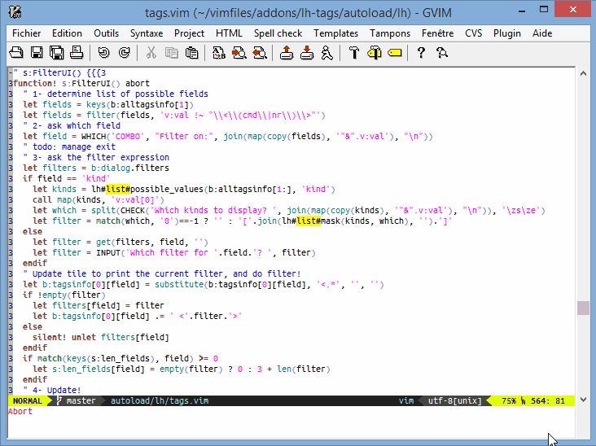

# lh-tags: a ctags wrapper for Vim

## Introduction

lh-tags is a ctags wrapper plugin for Vim.

This plugin has two features:
 * The generation of `tags` files is simplified,
 * and tag selection is simplified (the support for overloads (when
   _overloading_ is supported) is more ergonomic than what `:tselect` permits)

## Features

### Tags generation
 * Is portable: the plugin is regularly used on nixes, windows (with or without
   cygwin, and with `'shellslash'` on).
 * Is incremental: when a file under the watch of lh-tags is modified, only
   this file is parsed -- its previous information is deleted from the current
   `tags` file.
 * Can be run on the while project, when needed
 * Is, of course, [parametrisable](options).

### Tags selection
 * Presents all tags that match the selected text (`META-W-META-DOWN`), or the
   pattern used (`:LHTags`).
 * Can hide, or show, functions signatures (on `s`).
 * Permits to sort the results by `K`ind, `N`ame, or `F`ilename.
 * Can filter the results on any (ctags) field (_kind_, _name_, _filename_,
   _signature_, _namespace_, ...)
 * The selected tag can be jumped to in the current window (`CR`,
   _double-click_), or in a split window (`o`) -- the tags stack is updated
   along the way.



## Usage

In order to use lh-tags, I highly recommend to use a plugin like
[local_vimrc](http://github.com/LucHermitte/local_vimrc).

In the buffer local section, you'll have to:
 * adjust `(bg):tags_options_{ft}` if the default values don't suit you -- I
   often add exclusion lists in my projects.
 * set `b:tags_dirname` to the project root directory -- when my projects are
   compiled with CMake+whatever I use the variables from CMake encapsulation of
   [BuildToolsWrapper](http://github.com/LucHermitte/vim-build-tools-wrapper)
   to set `b:tags_dirname`.

For instance, a typical `_vimrc_local.vim` file will contain:
```vim
" Local vimrc variable for source dir
let b:project_sources_dir = g:FooBarProject_config.paths.sources
...
" ======================[ tags generation {{{2
" lh#path#fix() comes from lh-vim-lib
let b:tags_dirname = lh#path#fix(b:project_sources_dir)
let b:tags_options = ' --exclude="*.dox" --exclude="html" --exclude="*.xml" --exclude="*.xsd" --exclude=".*sw*"'
let b:tags_options .= ' --exclude="*.txt" --exclude="cmake" --exclude="*.cmake" --exclude="*.o" --exclude="*.os" --exclude="*.tags" --exclude=tags --exclude="*.tar"'
exe 'setlocal tags+='.(b:tags_dirname).'/tags'
```

Then, you'll have to generate the `tags` database once (`<C-X>ta`), then you
can enjoy lh-tag automagic update of the database, and improved tag selection.

## Options

 * `b:tags_dirname` defaults to empty string for the current directory; you'll
   have to set this option to the root of your project
 * `(bg):tags_options` defaults to empty string; you'll have to adjust these
   options to your needs.
 * `(bg):tags_options_{ft}` defaults to:
    * c: `'--c++-kinds=+p --fields=+imaS --extra=+q'`
    * cpp: `'--c++-kinds=+p --fields=+imaS --extra=+q --language-force=C++'`
    * vim: `'--fields=+mS --extra=+q'`
 * `(bg):tags_filename` defaults to `'tags'`; in case you want your `tags` file
   to have another name.
 * `(bg):tags_executable` defaults to `ctags`; you should not need to change
   it.
 * `(bg):tags_must_go_recursive` defaults to 1; set it to 0 if you really want
   to not explore subdirectories.
 * `(bg):tags_select` defaults to `'expand('<cword>')'`; this policy says how
   the current word under the cursor is selected by normal mode mapping
   `META-W-META-DOWN`.
 * `(bg):LHT_no_auto` defaults to 0; set it to 1 if you want to disable the
   automatic incremental update.
 * `(bg):tags_to_spellfile` defaults to empty string; this option permits to
   add all the tags to Vim spellchecker ignore list.  
```vim
" #### In _vimrc_local.vim
" spell files
setlocal spellfile=
exe 'setlocal spellfile+='.lh#path#fix(b:project_sources_dir).'/ignore.utf-8.add'
let b:tags_to_spellfile = 'code-symbols.utf-8.add'
exe 'setlocal spellfile+='.lh#path#fix(b:project_sources_dir.'/'.b:tags_to_spellfile)
```

## Mappings and commands

 * The tags for the current file can be explicitly updated with `CTRL-X_tc` --
   this mappings defaults to `<Plug>CtagsUpdateCurrent`
 * All the tags for the current project can be explicitly updated with
   `CTRL-X_ta` -- this mappings defaults to `<Plug>CtagsUpdateAll`
 * Tags matching the current word (or selection) will be presented on
   `META-W-META-DOWN` -- these two mappings default to `<Plug>CtagsSplitOpen`

 * We can also present the tags that match a pattern with `:LHTags` command
   (this command supports auto-completion on tag names)

## To Do

 * Auto-magically build `b:tags_dirname` from other variables (`&tags` with a
   compatible tags file specified with an absolute path, or root VCS directory)
 * This feature will require background generation for the first time.
 * Have behaviour similar to the one from the quickfix mode (possibility to
   close and reopen the search window; prev&next moves)
 * Show/hide declarations -- merge declaration and definitions
 * pluggable filters (that will check the number of parameters, their type, etc)


## Design Choices

## Installation
  * Requirements: Vim 7.+, [lh-vim-lib](http://github.com/LucHermitte/lh-vim-lib) v3.3.0
  * With [vim-addon-manager](https://github.com/MarcWeber/vim-addon-manager), install lh-tags (this is the preferred method because of the dependencies)
```vim
ActivateAddons lh-tags
```
  * or with [vim-flavor](http://github.com/kana/vim-flavor) which also supports
    dependencies
```
flavor 'LucHermitte/lh-tags'
```
  * or you can clone the git repositories
```
git clone git@github.com:LucHermitte/lh-vim-lib.git
git clone git@github.com:LucHermitte/lh-tags.git
```
  * or with Vundle/NeoBundle:
```vim
Bundle 'LucHermitte/lh-vim-lib'
Bundle 'LucHermitte/lh-tags'
```

[](https://www.openhub.net/p/21020)
